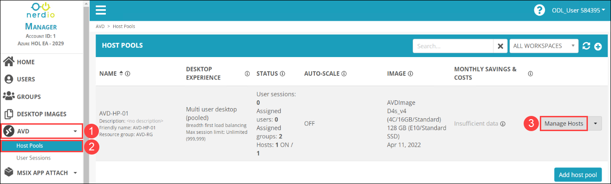
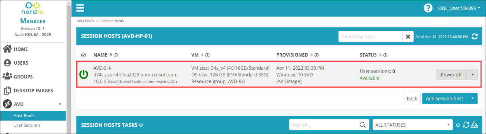
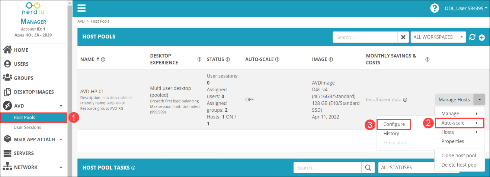
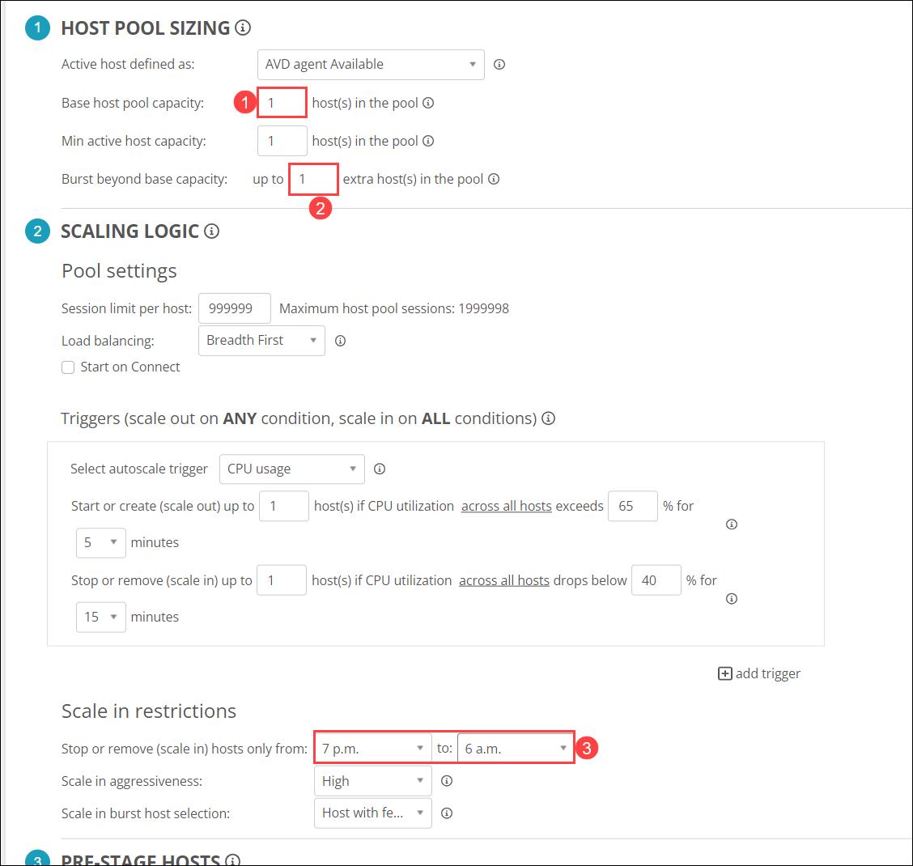
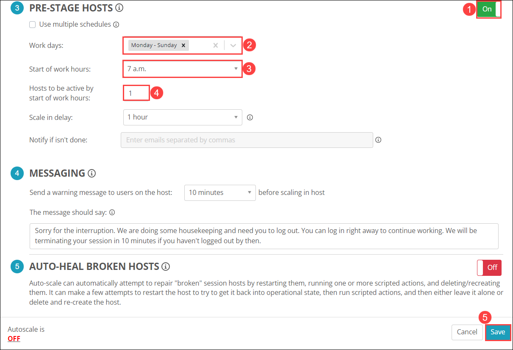

# Lab 5: Configure Auto Scaling

## Overview

The autoscale feature lets you scale your AVD Host Pools up or down to optimize deployment costs. Based on your needs, you can make a scaling plan based on the time of day, specific days of the week, and session limits per session host. In this lab, you'll be configuring auto-scaling of the AVD host pool in your NMM Account. 

## Exercise 1: Configure Auto Scaling

In this exercise, We'll be configuring auto-scaling of an existing AVD Host Pool in your NMM Account.  
   
1. In NMM portal, Click on **AVD** ***(1)*** and Select **Host Pools** ***(2)***, then Click on **Manage Hosts** ***(3)*** next to AVD-HP-01 host pool

   
   
1. Verify that the session host exists under the AVD-HP-01 host pool.

   
    
   >**NOTE**: If the Session host is still deploying. Wait till the deployment is completed.

1. Click on **Host Pools** ***(1)*** on the left-hand side blade and click on the **Manage Hosts** button and navigate to **Auto-scale >** ***(2)*** **Configure** ***(3)***.

   
   
1. Under **HOST POOL SIZING**, Set **Base host pool capacity** to ```1``` ***(1)*** and set **Burst beyond base capacity** to ```1``` ***(2)***. Under **SCALING LOGIC**, Set **Stop or remove (scale in) hosts only from** ```7 p.m.``` to ```6 a.m.```.

   
   
1. Under **PRE-STAGE HOSTS**, provide the following details, then Click on **Save** ***(5)***.

   - **Toggle** the switch On next to **PRE-STAGE HOSTS** ***(1)***.
   - Work days: **Monday-Friday** ***(2)***.
   - Start of work hours: **7 a.m.** ***(3)***.
   - Hosts to be active by the start of work hours: **1** ***(4)***.

   
   
1. Click on the **Next** button present in the bottom-right corner of this lab guide.
