# Lab 6: Scripted actions and App masking

## Overview

## Exercise 1: Enable Scripted Actions

1. From the NMM portal, Click on the **Nerdio icon** from left top bottom to go back to home page.

   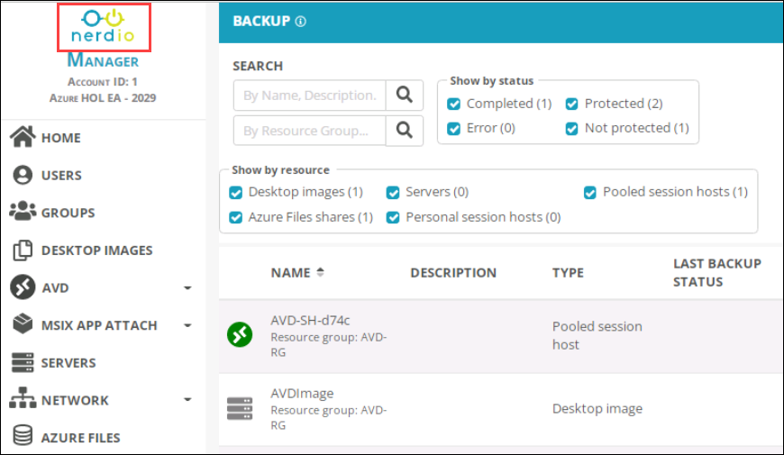
      
1. In home page, Click on **SCRIPTED ACTIONS** ***(1)*** and select **Windows scripts** ***(2)***. Then, Click on **drop down** ***(3)**** icon next to the view button of the Install Microsoft 365 Office Apps and select the **Assign Accounts** ***(2)*** option.

   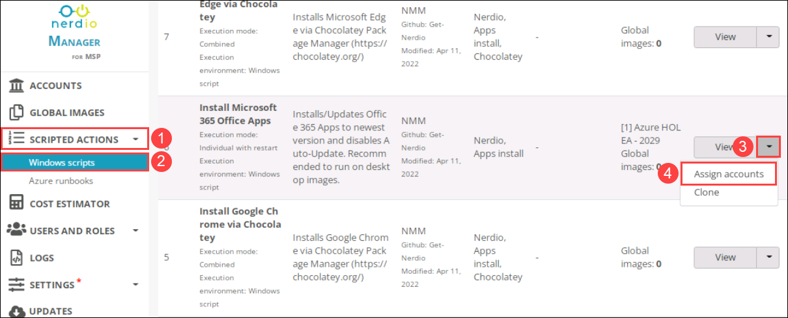
   
1. In ASSIGN ACCOUNTS TO INSTALL MICROSOFT 365 OFFICE APPS SCRIPTED ACTION window, Select the **default** ***(1)*** account and click on **OK** ***(2)***.

   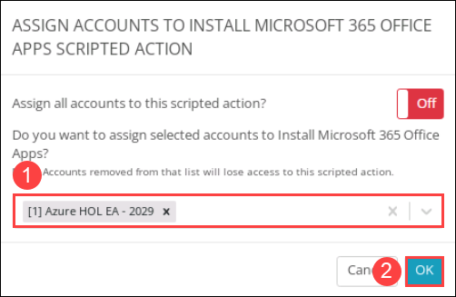
   
1. In the NMM portal, Under **Accounts** ***(1)*** from the side blade and click on **Manage** ***(2)*** next to the default NMM Account which we created in Lab 1.

   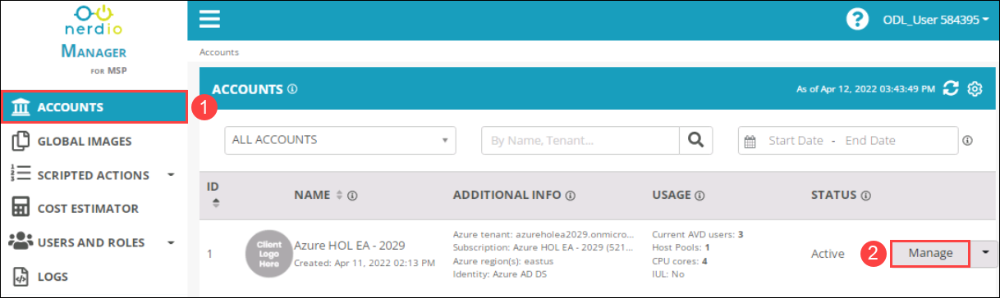
   
1. From the Account page, Click on **AVD** ***(1)*** and Select **Host Pools** ***(2)*** from the left-hand side blade.

   
   
   
1. From the Account page, Click on **AVD** ***(1)*** and Select **Host Pools** ***(2)*** from the left-hand side blade.

   
   
1. Click on the **drop-down** ***(1)*** icon next to the manage button of the AVD-HP-01 host pool and select the **Properties** ***(2)*** option.

   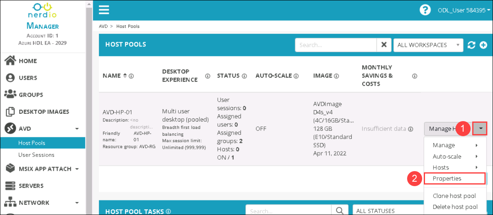
   
1. In AVD-HP-01 PROPERTIES page, Select **VM Deployment** from the left-hand side blade.

   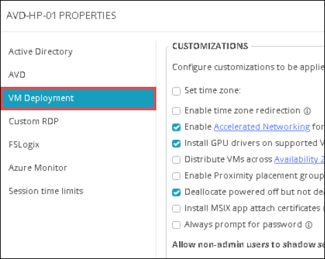
   
1. In SCRIPTED ACTIONS, Provide the follwoing details and click on **Save & Close** ***(3)***.

   - Run Scripted actions when host VM is CREATED: **Toggle On** ***(1)*** the option
   - Windows scripts: Select **Install Microsoft 365 Office Apps(Individual with restart)(Nerdio Apps install).

   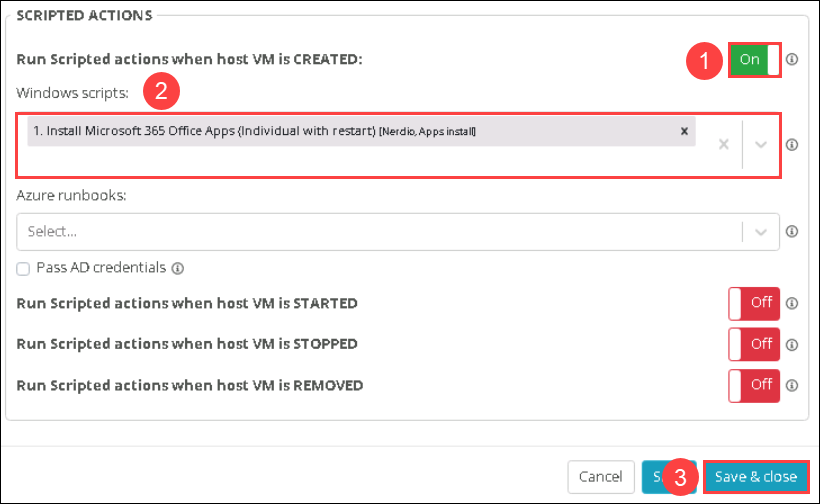
   
## Exercise 2: Add Rule set to enable App masking
   
1. In the Host pools page, click on **Manage Hosts** ***(2)*** of AVD-HP-01 host pool.

   
   
1. Click on the **drop-down** ***(1)*** icon next to the Power Off button of the session host and select the **Resize/Re-image** ***(2)*** option.

   
   
1. In RESIZE OR RE-IMAGE SESSION HOST window. Select **AVD IMAGE** ***(1)*** from the drop-down of DESKTOP IMAGE and click on **OK** ***(2)***.

   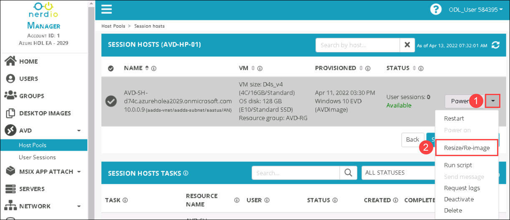
   
1. A Task is created for Reimage VM in SESSION HOSTS TASKS. Click on details to check on job details.

   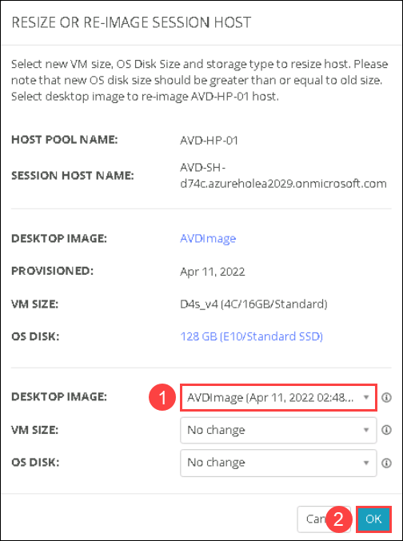
   
   >**Note**: Please wait untill the Reimage task completes.

1. In CREATE RULE SET page, Proive the following details and click on **Save & apply** ***(5)***.

   - RULE SET NAME: **Microsoft Office** ***(1)***
   - Applications: Select **Microsoft 365 Apps for enterprise - en-us** ***(2)*** from the drop down
   - Available to Everyone: **Uncheck** ***(3)***the option.
   - Allow only the following users and groups: Type **AVD MSOffice Users** ***(4)*** and select the same.

   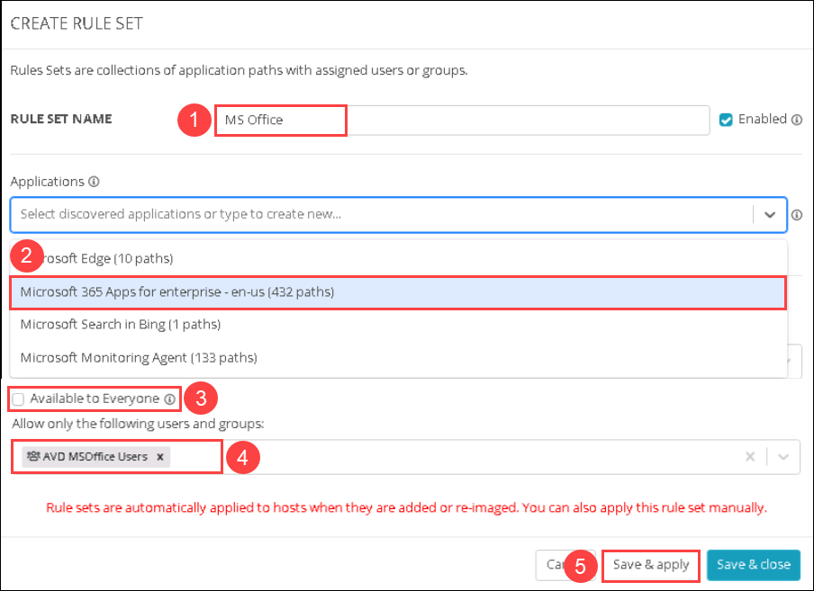
 
1. In APPLY RULE SETS ON HOST POOL VMS page, Select **Do not clear any rule sets, overwrite rule sets being applied only** ***(1)*** from the drop-down and click on **OK** ***(2)***.

   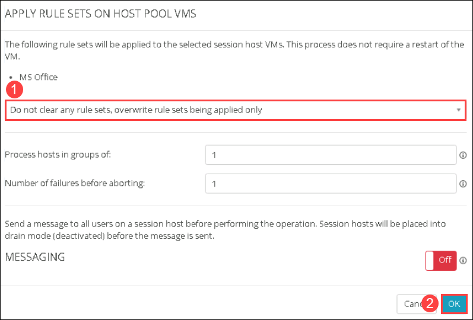

    
   
   

