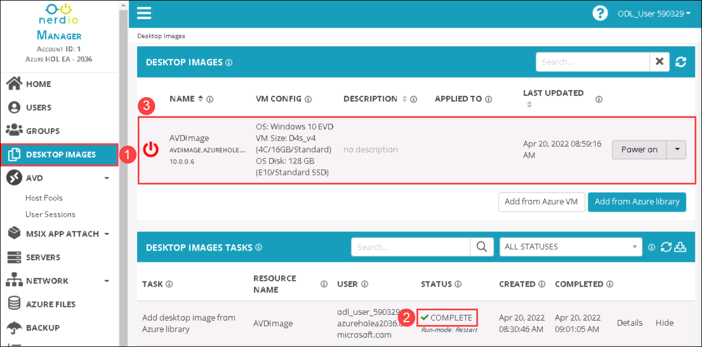
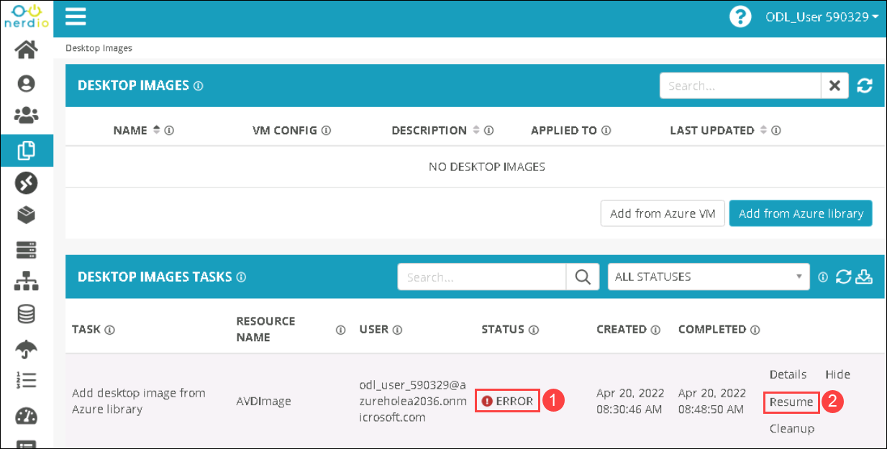
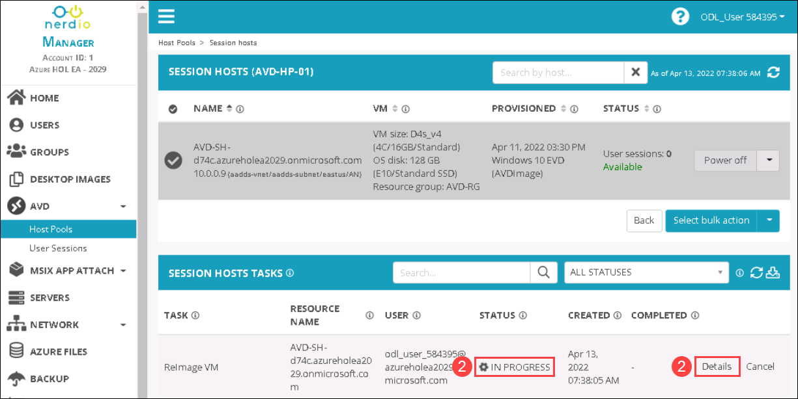
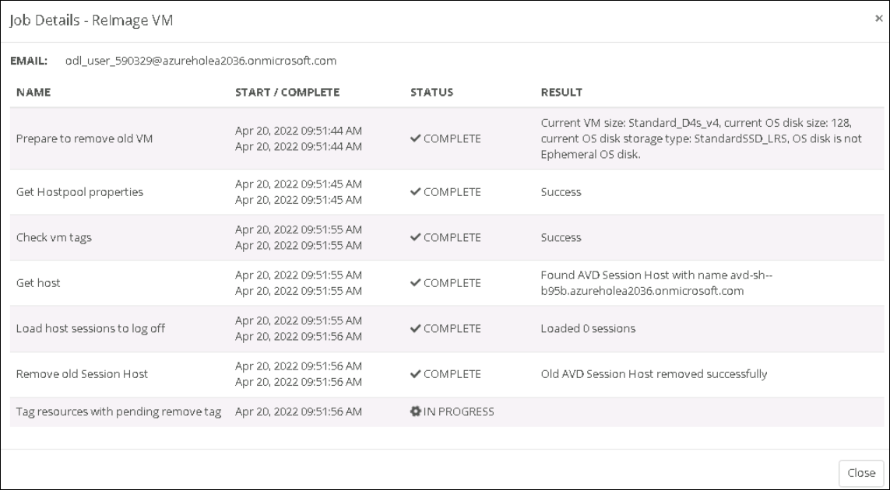
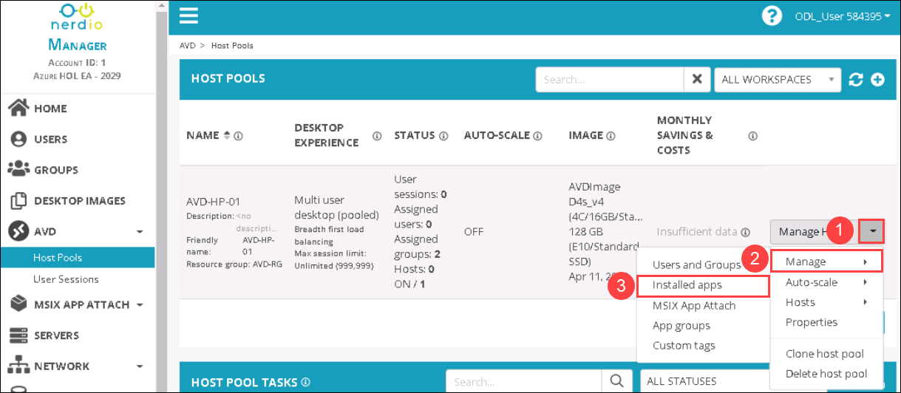
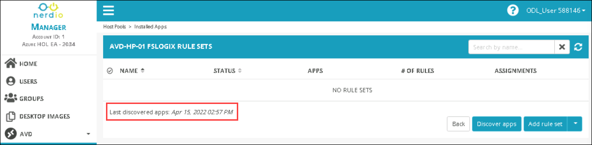
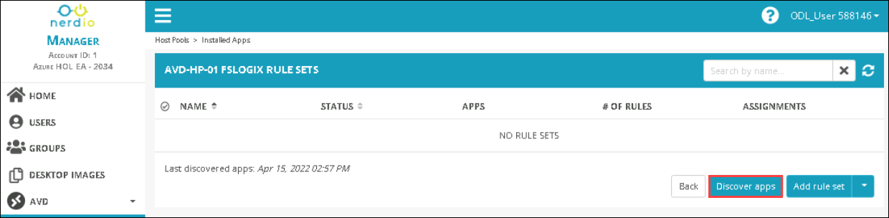
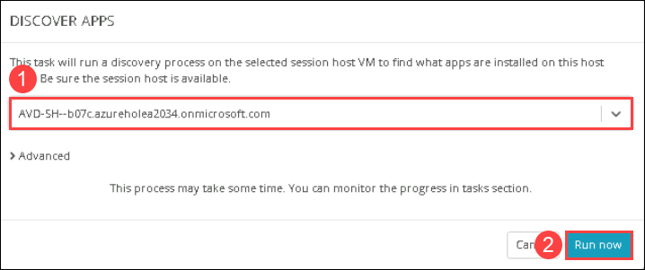
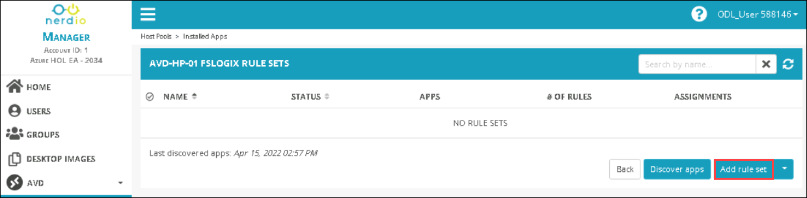
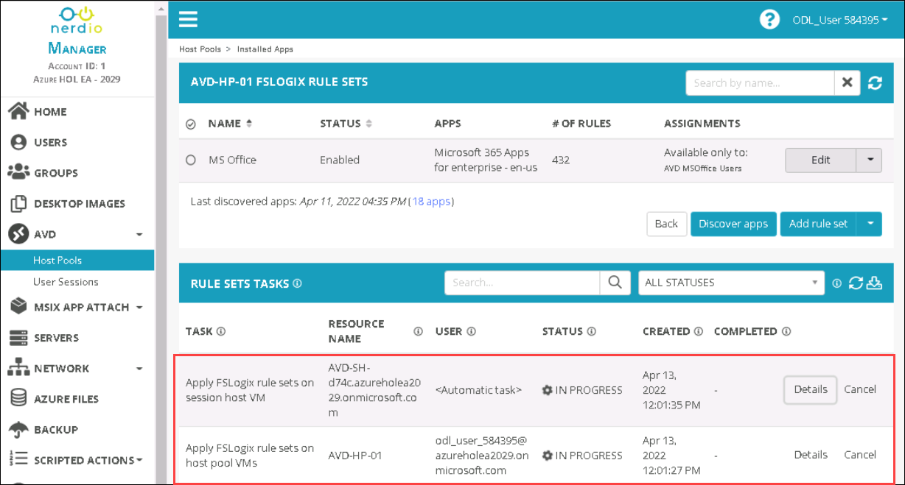

# Lab 7: Scripted actions and App masking

## Overview

Scripted Actions are a library of PowerShell scripts that can be run in either Azure or AVD Virtual Machines as another step for various tasks performed by Nerdio Manager for MSP. Desktop Auto-scaling feature helps users optimize their costs by paying only for the Nerdio resources used. Desktop auto-scaling takes advantage of the elasticity of cloud-hosted environments to increase or decrease resources as per individual requirements.

## Exercise 1: Enable Scripted Actions

In this exercise, we'll enable scripted actions to install Microsoft Office 365.

1. From the NMM portal, Click on the **Nerdio icon** from left top bottom to go back to home page.

   
      
1. In home page, Click on **SCRIPTED ACTIONS** ***(1)*** and select **Windows scripts** ***(2)***. Then, Click on **drop down** ***(3)*** icon next to the view button of the Install Microsoft 365 Office Apps and select the **Assign Accounts** ***(4)*** option.

   
   
1. In ASSIGN ACCOUNTS TO INSTALL MICROSOFT 365 OFFICE APPS SCRIPTED ACTION window, Select the **default** ***(1)*** account and click on **OK** ***(2)***.

   
   
1. In the NMM portal, Under **ACCOUNTS** ***(1)*** from the side blade and click on **Manage** ***(2)*** next to the default NMM Account which we created in Lab 1.

   
   
1. From the Account page, Click on **AVD** ***(1)*** and Select **Host Pools** ***(2)*** from the left-hand side blade.

   
   
1. Click on the **drop-down** ***(1)*** icon next to the manage button of the AVD-HP-01 host pool and select the **Properties** ***(2)*** option.

   
   
1. In AVD-HP-01 PROPERTIES page, Select **VM Deployment** from the left-hand side blade.

   
   
1. In SCRIPTED ACTIONS, Provide the following details and click on **Save & Close** ***(3)***.

   - Run Scripted actions when host VM is CREATED: **Toggle On** ***(1)*** the option
   - Windows scripts: Select **Install Microsoft 365 Office Apps(Individual with restart)(Nerdio Apps install)** ***(2)*** from the drop-down

   
   
## Exercise 2: Reimage Session desktop and Add Rule set

In this exercise, We'll reimage the existing session host using desktop image which we created in lab 2 to install Microsoft Office 365 application.

1. In the NMM portal, Under **Accounts** ***(1)*** from the side blade and click on **Manage** ***(2)*** next to the default NMM Account which we created in Lab 1.

   
   
1. Select **DESKTOP IMAGES** ***(1)*** from the left-hand side blade, Make sure that the **AVDImage image creation** **(2)** is completed successfully and is ready for use **(3)**.

    
   
   >**Note**: Incase the image creation has failed with **ERROR** **(1)** status. Please **Resume** **(2)** the task and wait till the image creation completes.

    
   
1. In the NMM portal, Click on **AVD** ***(1)*** and Select **Host Pools** ***(2)*** from the left-hand side blade.

   
   
1. In the Host pools page, click on **Manage Hosts** ***(2)*** of AVD-HP-01 host pool.

   
   
1. Click on the **drop-down** ***(1)*** icon next to the Power Off button of the session host and select the **Resize/Re-image** ***(2)*** option.

   
   
1. In RESIZE OR RE-IMAGE SESSION HOST window. Select **AVD IMAGE** ***(1)*** from the drop-down of DESKTOP IMAGE and click on **OK** ***(2)***.

   
   
1. A Task is created for Reimage VM in SESSION HOSTS TASKS. You can verify the status of reimage creation process as in (1) and also view details by clicking on (2).

   
   
1. Details page would appear as below.

   
   
   >**Note**: Since Reimaging task takes around 20 - 30 minutes to complete. You can perform **Lab 11: Cost Estimator** as it is a independent lab. Once completing the Lab 11, You can revisit the step to continue this lab.

1. Go back to **Host pools** ***(1)*** page, Select **Manage** ***(2)*** > **Installed apps** ***(3)*** from the drop-down next to manage option of AVD-HP-01 host pool.

   
   
   >**Note**: In case if you don't see the **Last discovered apps** notfication in the rule set page. Follow step 6 to step 7.  Else continue from step 8. 

   
   
1. In AVD-HP-01 FSLOGIX RULE SETS page, Click on **Discover apps**.

   
   
1. In Discover apps page, Select the **default session host** ***(1)*** from the drop-down and click on **Run now** ***(2)*** 
   
   
   
   >**Note**: Please wait until the Discover apps task completes.
   
1. In AVD-HP-01 FSLOGIX RULE SETS page, Click on **Add rule set**.

   

1. In CREATE RULE SET page, Provide the following details and click on **Save & apply** ***(5)***.

   - RULE SET NAME: **MS Office** ***(1)***
   - Applications: Select **Microsoft 365 Apps for enterprise - en-us** ***(2)*** from the drop down
   - Available to Everyone: **Uncheck** ***(3)*** the option.
   - Allow only the following users and groups: Type **AVD MSOffice Users** ***(4)*** and select the same.

   
   
1. In APPLY RULE SETS ON HOST POOL VMS page, Select **Do not clear any rule sets, overwrite rule sets being applied only** ***(1)*** from the drop-down and click on **OK** ***(2)***.

   
   
1. New Tasks will be created for applying the rule set. Wait until the tasks completes. In meantime you can click on details and observe the creation process.

   
   
1. Click on the **Next** button present in the bottom-right corner of this lab guide.

