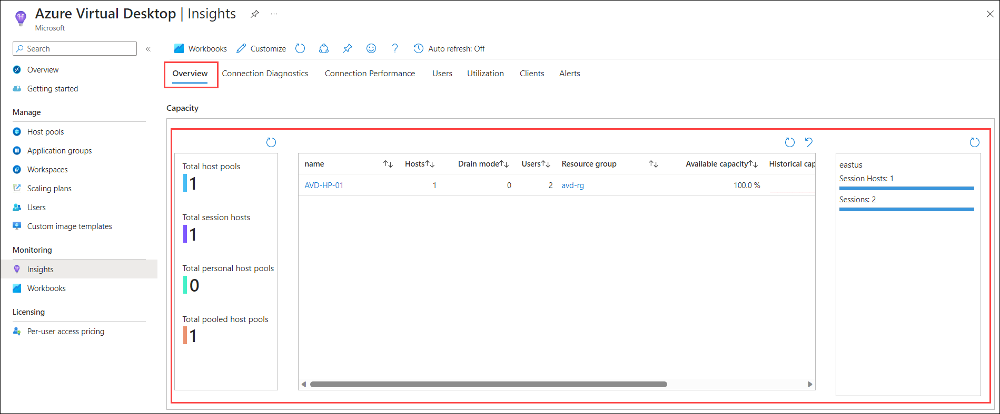
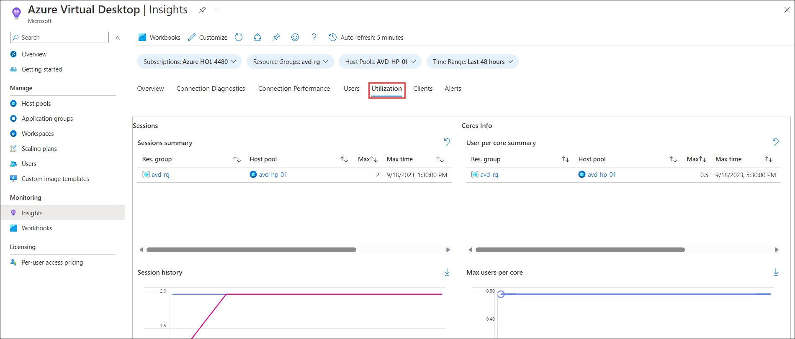

# Lab 9: Monitoring using Azure Monitor for AVD

## Overview

Azure Monitor helps you maximize the availability and performance of your applications and services. Nerdio Manager for MSP lets us view the Azure Monitoring insights through the NMM Portal. In this lab, you'll be accessing the Azure Monitor using Nerdio Manager for MSP and monitoring the Azure Virtual Desktop in the Azure portal.

## Exercise 1: Access Azure Monitor using Nerdio Manager

In this exercise, We'll be accessing the Azure Monitor using Nerdio Manager to monitor the Azure Virtual Desktop. 
   
1. From the left-hand side blade, Click on **MONITORING**.

   
  
1. Under the Monitoring Insights pop-up, Click on **Continue** which will redirect to the AVD Insights page in the Azure portal.

   
   
1. Under **Azure Virtual Desktop | Insights**, **Click** on the **Overview** tab, you can go through **Capacity, Connection diagnostics: % of users able to connect, Connection performance: Time to connect (new sessions), and Utilization**.

   
   
1. Click on the **Connection Diagnostics** tab, This tab gives us information about Session connections and connectivity rate insights.

   
   
1. Click on the **Users** ***(1)*** tab, Enter **<inject key="NMM User 01" />** /**<inject key="NMM User 02" />** ***(2)*** under **UPN to search for**, and wait for the data to load. This tab gives an overview of the user's usage. Scroll down and explore different information loaded.

   
   
   **Note**: Generation of logs in the users tab might take time. In case you are not able to see the logs, please consider changing the time range from the overview page.   
   
1. Click on the **Utilization** tab, This tab gives us information about the session summary, core info, and more information about the utilization of resources.

   
   
1. Click on the **Clients** ***(1)*** tab, Here we'll be able to monitor the number of users connected to AVD using the browser and remote client application.

   
   
1. Spend some time on the page to explore different monitoring abilities offered by Azure Insights.

1. Click on the **Next** button present in the bottom-right corner of this lab guide.

