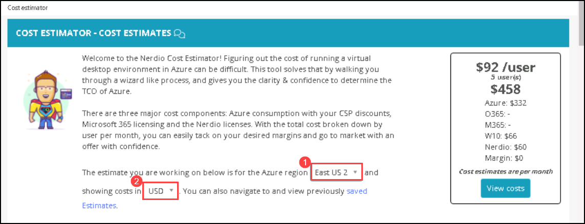
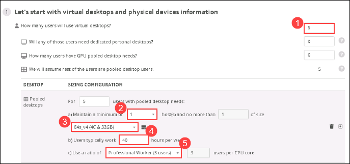
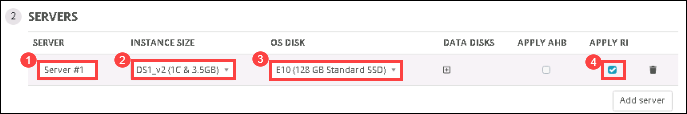
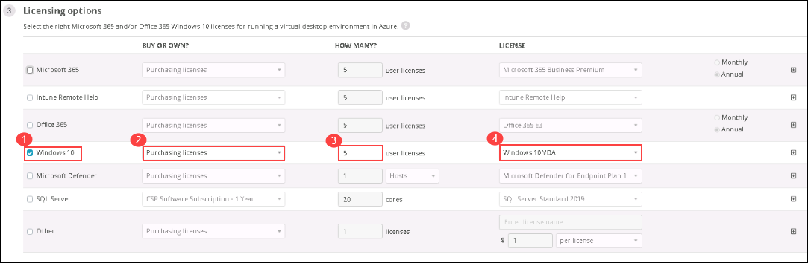
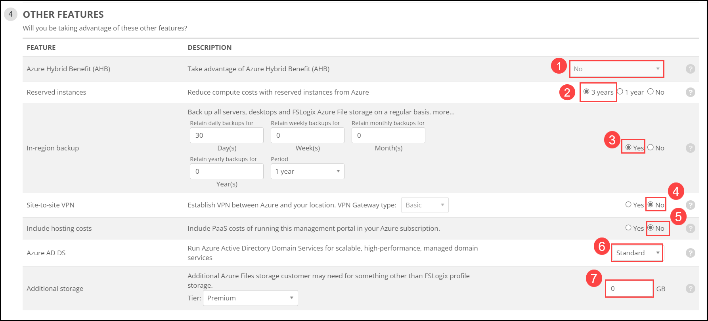
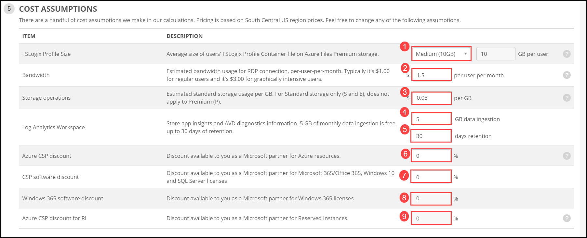

# Lab 10: Cost Estimator

## Overview

Cost Estimator is a tool in Nerdio Manager for MSP that figures out the cost of running a virtual desktop environment in Azure by walking you through a wizard-like process and gives you the clarity & confidence to determine the TCO of Azure. In this lab, you'll be viewing the costs of your resources by specifying the desired values. 

## Exercise 1: View costs using Cost Estimator

In this exercise, you'll view the costs of your resources using the Cost Estimator in the NMM portal.

1. From the NMM portal, click on **COST ESTIMATOR** from the side blade and you will be redirected to the *COST ESTIMATOR - COST ESTIMATES* page. On the *COST ESTIMATOR - COST ESTIMATES* page select **<inject key="Resource group Location" enableCopy="false" /> (1)** for *Azure region* from drop-down and for *showing the cost in* select **USD (2)**.

    
   
1. In **STEP 1: Let's start with desktops and physical devices information**, provide the following details.

   * How many users will use Virtual desktops?:  **5** ***(1)*** 
   * Minimum number of host(s):  **1** ***(2)***
   * Size:  **E4s_v4(4C/32GB)** ***(3)***
   * User typically work:  **40** ***(4)***
   * Ratio of users per CPU:  **Professional Worker (3 users)** ***(5)***
   
     
   
1. In **STEP 2: SERVERS**, click on **Add server**.

    

   Provide the following details to add a server.
   
   * SERVER:  **Server #1** ***(1)***
   * INSTANCE SIZE:  **DS1_v2(1C/3.5GB)** ***(2)***
   * OS DISK:  **E10 (128 GB/Standard SSD)** ***(3)***
   * APPLY RI:  **Yes** ***(4)***

    
   
1. In **STEP 3: Licensing options**, provide the following details to assign licenses.

   * Select **Windows 10** ***(1)***
   * BUY OR OWN?:  **Purchasing licenses** ***(2)***
   * HOW MANY?:  **5** ***(3)***
   * LICENSE:  **Windows 10 VDA** ***(4)***
   
    
    
    >**Note**: Uncheck the check box of **Microsoft 365** if it is selected by default.
   
1. In **STEP 4: OTHER FEATURES**, provide the following details to add the other features.

   * Azure Hybrid Benefit (AHB):  **No** ***(1)***
   * Reserved Instances:  **3 years** ***(2)***
   * In-region backup:  **Yes** ***(3)***
   * Site-to-site VPN:  **No** ***(4)***
   * Include hosting costs: **No** ***(5)***
   * Azure AD DS: **Standard** ***(6)***
   * Additional storage:  **0** ***(7)***
   
    

1. In **STEP 5: COST ASSUMPTIONS**, provide the following details to assume further costs.

   * FSLogix Profile Size:  **Medium (10GB)** ***(1)***
   * Bandwidth:  **1.5** ***(2)***
   * Storage operations:  **0.03** ***(3)***
   * Log Analytics Workspace:  **5** ***(4)*** & **30** ***(5)***
   * Azure CSP discount:  **0** ***(6)***
   * CSP software discount:  **0** ***(7)***
   * Windows 365 software discount:  **0** ***(8)***
   * Azure CSP discount for RI:  **0** ***(9)***
   
    
   
1. Once you click on *View costs*, you will be able to see **COST ESTIMATES**, **RESOURCES** and **AZURE COSTS BREAKDOWN** cost details. Click on **Save**.

    
   
    
   
1. In the **SAVE AS** page, name it as **COST ESTIMATES** ***(1)*** and click on **Save** ***(2)***.

    
   
1. Click on the **Next** button present in the bottom-right corner of this lab guide.

Congratulations, You have completed the lab.

  
      
