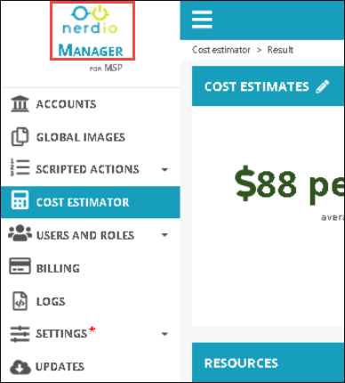
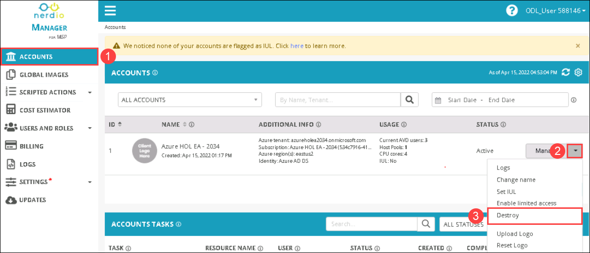
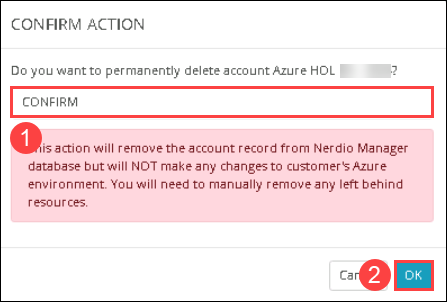
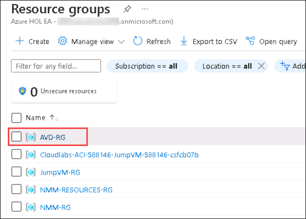
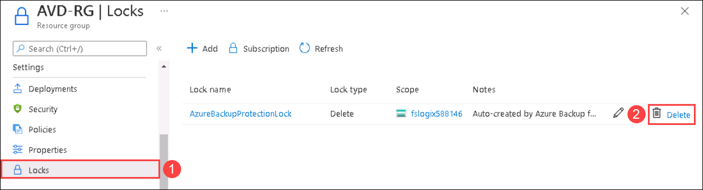

# Clean up resources

1. From the NMM portal, Click on the **Nerdio** icon from left top bottom to go back to home page.

   
   
1. Under **Accounts** ***(1)*** from the side blade, Click on the **drop-down** ***(1)*** icon next to the manage button of the default account and select the **Destroy** ***(2)*** option.

   
  
1. In CONFIRM ACTION page, Type **CONFIRM** ***(1)*** in Do you want to permanently delete account AZURE HOL XX - XXXX? option and click on **OK** ***(2)***.

   

1. From the Azure portal, click on **Resource Groups** present under *Navigate*.

   

1. You will see a list of resource groups as shown in the image below. Click on **NMM-RG** to open it.

   
   
1. Click on **Delete resource group** ***(1)***, In **Are you sure you want to delete "NMM-RG"..** window, Provide the **RG Name** ***(2)*** and click on **Delete** ***(3)***.

   
   
1. Go back to **Resource Groups** page and click on **AVD-RG** to open the resource group.

    

1. In AVD-RG page, Click on **Locks** ***(1)*** from settings side blade and click on **Delete** ***(2)*** to delete the RG lock.

    
