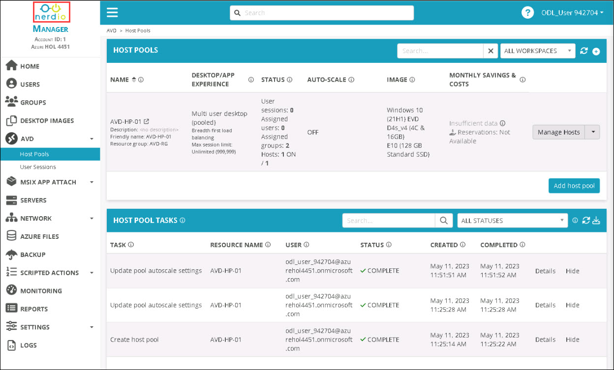
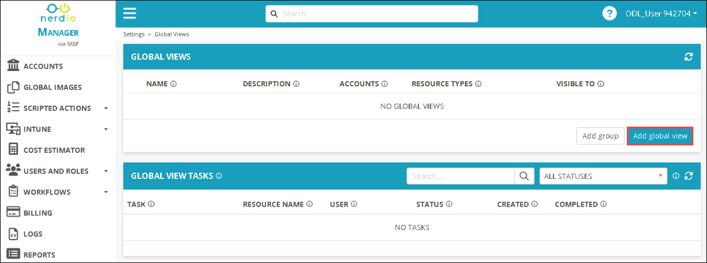
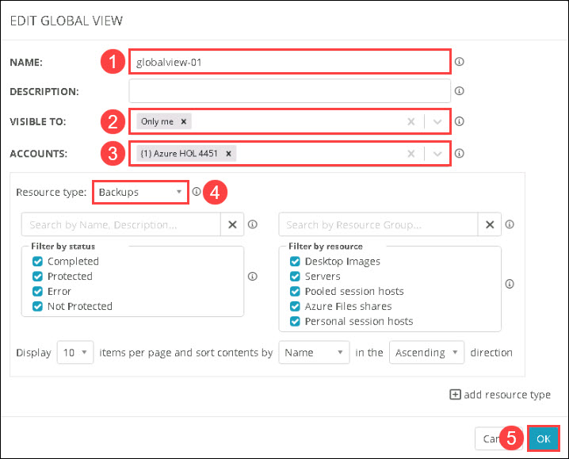
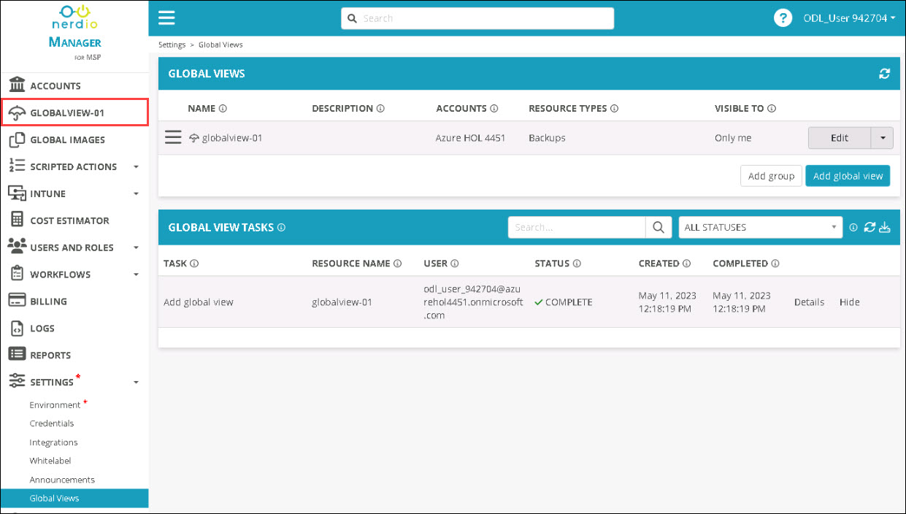
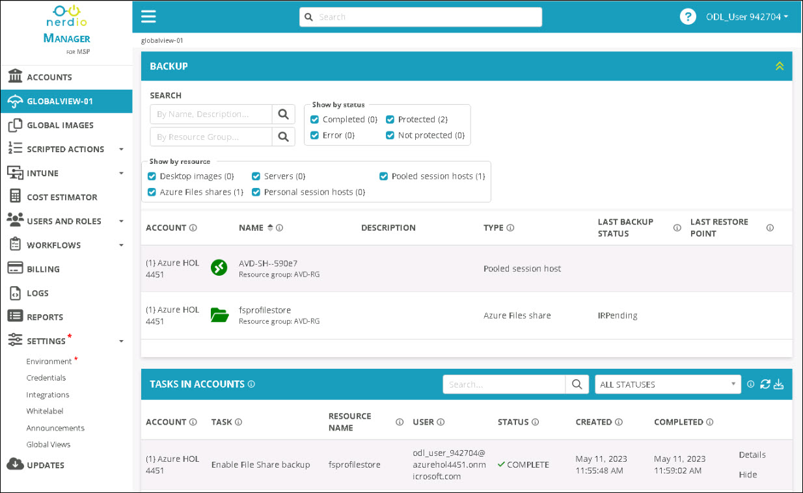

# Lab 6: Global multi-tenant management

## Overview

Nerdio Manager allows you to create global views that best represent your workflows. For example, if you manage host pools, session hosts, and user sessions, there is no need to keep jumping back and forth between pages to manage these different resources. With global views, you can combine all the resources on a single page. 

## Exercise 1: Create a Global view using the NMM portal

In this exercise, you'll be configuring a global view for Backup using the NMM portal.

1. click on the **Nerdio** logo to return to the home page.

   

1. From the **Settings (1)** side blade, select **Global views (2)**.

   

1. Click on **Add global view**.

   

1. In the EDIT GLOBAL VIEW page, provide the following details to create a new global view.

   - NAME: **globalview-01** ***(1)***
   - VISIBLE TO: **Only me** ***(2)***
   - ACCOUNTS: **Azure HOL (ID)** ***(3)***
   - Resource type: scroll down in the list and select **Backups** ***(4)*** from common.
   - Leave other options to default and click on **OK** ***(5)***

      

1. Once the creation is completed. You'll be able to see the **globalview-01** global view in the side blade. select to open it.

     

1. You'll be able to see the BACKUP tab in the global view.

    

1. Click on the **Next** button present in the bottom-right corner of this lab guide.   

