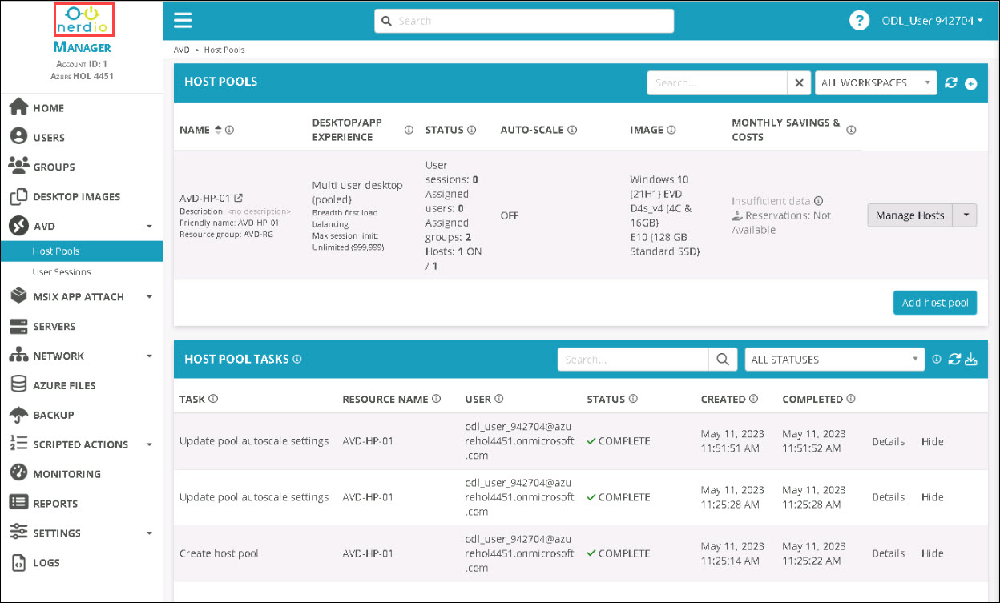

# Lab 8: Intune and Workflows

Task 1: Intune overview

Microsoft Intune is a cloud-based service that focuses on mobile device management (MDM) and mobile application management (MAM). Using Microsoft Intune, you can manage your organization’s devices, laptops, tablets, Cloud PCs, and Azure Virtual Desktops.

## Task 1: Add Intune Configuration profiles

1. From NMM portal side blade, Click on **drop-down (1)** button next to Intune and select **Configuration profiles (2)**.

    

1. In the CONFIGURATION PROFILES page, search for **NMM Edge automatic sign-in (1)** using the search bar and click on **Assign (2)**.

    

1. In the ASSIGNMENTS - NMM EDGE AUTOMATIC SIGN-IN page, click on **Add assignments**.

    

1. In the POLICY ASSIGNMENTS - NMM EDGE AUTOMATIC SIGN-IN pop-up, select **All (1)** for Assignments and click on **Confirm (2)**.

    

1. After adding assignments, select **Keep in sync (1)** option and click on **Apply and close (2)**

    

1. In the APPLY CHANGES - NMM EDGE AUTOMATIC SIGN-IN pop-up, click on **Confirm** to save. 

    

## Task 2: Workflows 

Nerdio Manager provides MSPs with a workflow-based approval system to control which tasks are run. MSPs can require approval of certain tasks to be given before they are run by designating roles for Approvers and Submitters. Approvers receive an in-app and email notification whenever a task is submitted for approval.  This helps not only to ensure efficient operations but also reduce human error especially around activities like adding a server or resizing a virtual machine that can significantly impact the cost per environment. 

In this task, you'll create a approval request for MSP users using NMM portal.

1. click on the **Nerdio** logo to return to home page.

    

1. From NMM portal side blade, Click on **drop-down (1)** button next to USERS AND ROLES and select **Role assignments (2)**.

    

1. On the role assignments tab, click on **Add**.

    

1. In the ASSIGN ROLE TO USERS OR GROUPS pop-up, please provide the following details and click on **OK** ***(5)***.

   - ROLE: **MSP ADMIN** ***(1)***
   - ACCOUNTS: **ALL** ***(2)***
   - USERS/GROUPS: Enter **nmmuser01** ***(3)*** and select the same from the list
   - ACCESS EXPIRATION: **NEVER** ***(4)***

      

1. From NMM portal side blade, Click on **drop-down (1)** button next to WORKFLOWS and select **Approval Rules (2)**.     

     

1. In the APPROVAL RULES tab, click on **Add**.

     

1. In the ADD APPROVAL pop-up, provide the following details and click on **OK** ***(6)***.

   - Name: **Destroy Approval** ***(1)***
   - Level: Select **MSP** ***(2)*** from the drop-down list.
   - Task Categories: Select **Destructive** ***(3)*** from the drop-down list.
   - Submitters: Select **MSP Admin** ***(4)*** from the drop-down list.
   - Approvers: Select **Super Admin** ***(5)*** from the drop-down list.

     
